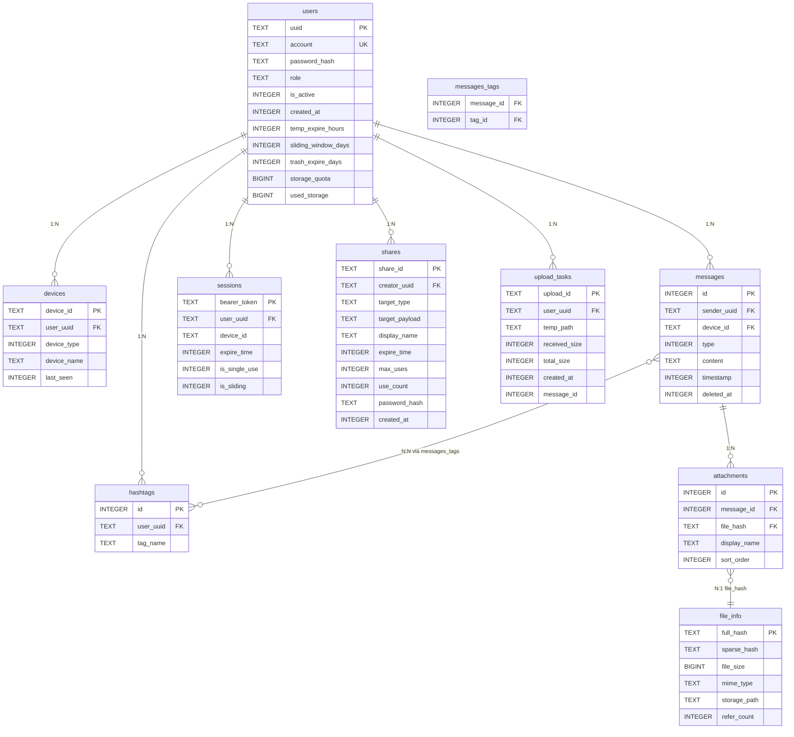

# U-Drop 数据库设计方案

## 1. 技术选型

| 项目     | 选择                           | 理由                                         |
| -------- | ------------------------------ | -------------------------------------------- |
| 数据库   | SQLite                         | 嵌入式、零部署、单文件，适合中小规模私有部署 |
| ORM      | Peewee                         | 轻量、Pythonic、与 FastAPI 配合自然          |
| 主键策略 | TEXT (UUID) / TEXT (自定义ID)  | 多端同步友好，避免自增ID冲突                 |
| 时间存储 | INTEGER (Unix timestamp)       | 时区无关，比 DATETIME 更灵活                 |
| 文件哈希 | Blake3 (全量) + MD5 (快速稀疏) | Blake3 安全且快；MD5 用于秒传检测            |

## 2. 架构分层

```
database/
├── connect.py   ← 连接管理（单例 SqliteDatabase）
├── models.py    ← Peewee ORM 模型定义
├── setup.py     ← 建表 + 种子 + 增量迁移
└── README.md    ← 本文件
```

### 调用链

```
setup()  →  Database() 获取连接  →  create_tables(ALL_MODELS)  →  _run_migrations()
               ↓
         PRAGMA: WAL / foreign_keys / busy_timeout
```

### 与 server/db/ 的关系

`server/database/` 是按 server-example 架构风格重新组织的独立模块。目前 `server/db/` 仍在被主程序引用，`database/` 作为新架构的预备实现，待切换后可替换 `db/`。

## 3. 表结构设计

### 3.1 users — 用户表

核心身份表，存储认证与配额信息。

```sql
CREATE TABLE users (
    uuid TEXT PRIMARY KEY,               -- UUID 主键，多端同步安全
    account TEXT NOT NULL UNIQUE,         -- 登录账号
    password_hash TEXT NOT NULL,          -- argon2 加盐哈希
    role TEXT DEFAULT 'user',             -- admin | user
    is_active INTEGER DEFAULT 1,
    created_at INTEGER NOT NULL,           -- Unix timestamp
    temp_expire_hours INTEGER DEFAULT 24,  -- 临时 Session 有效小时
    sliding_window_days INTEGER DEFAULT 30, -- 滑动窗口续期天数
    trash_expire_days INTEGER DEFAULT 30,  -- 回收站保留天数
    storage_quota BIGINT DEFAULT 5368709120, -- 默认 5GB
    used_storage BIGINT DEFAULT 0         -- 已用字节数
);
```

**设计要点**：

- 主键用 `uuid` 而非自增 ID — 多客户端离线创建消息时无需协调 ID 分配
- 配额与过期策略直接存在用户行上 — 减少联表查询，权限检查一步到位

### 3.2 devices — 设备表

每台登录设备一条记录，用于多端管理和推送。

```sql
CREATE TABLE devices (
    device_id TEXT PRIMARY KEY,           -- 前端生成
    user_uuid TEXT NOT NULL,
    device_type INTEGER NOT NULL,         -- 0:Web, 1:Android, 2:PC
    device_name TEXT,
    last_seen INTEGER NOT NULL,
    FOREIGN KEY (user_uuid) REFERENCES users(uuid) ON DELETE CASCADE
);
```

### 3.3 file_info — 物理文件表

纯物理层，不涉及业务语义。通过 `refer_count` 实现引用计数去重。

```sql
CREATE TABLE file_info (
    full_hash TEXT PRIMARY KEY,           -- Blake3 全量哈希
    sparse_hash TEXT,                     -- MD5 快速哈希（头+中+尾拼接）
    file_size BIGINT NOT NULL,
    mime_type TEXT,
    storage_path TEXT NOT NULL,           -- local://storage/xx/yy
    refer_count INTEGER DEFAULT 0         -- 附件表维护
);
CREATE INDEX idx_file_sparse_hash ON file_info(sparse_hash);
```

**秒传流程**：

1. 客户端上传前计算 sparse_hash，请求后端检查
2. 后端查 `file_info.sparse_hash` → 若匹配则直接引用，跳过传输
3. 传输完成后计算 full_hash，更新或确认去重

### 3.4 messages — 消息/时间线主表

核心业务表，设计为**轻量行**（文本内联，附件外置）。

```sql
CREATE TABLE messages (
    id INTEGER PRIMARY KEY AUTOINCREMENT,
    sender_uuid TEXT NOT NULL,
    device_id TEXT NOT NULL,
    type INTEGER NOT NULL,                -- 0:文本, 1:混合/附件
    content TEXT,                         -- 纯文本内容
    timestamp INTEGER NOT NULL,
    deleted_at INTEGER,                   -- 软删除时间戳，NULL 表示正常
    FOREIGN KEY (sender_uuid) REFERENCES users(uuid) ON DELETE CASCADE,
    FOREIGN KEY (device_id) REFERENCES devices(device_id)
);
CREATE INDEX idx_msg_timestamp ON messages(timestamp);
CREATE INDEX idx_msg_lookup ON messages(sender_uuid, deleted_at, id DESC);
```

**设计要点**：

- `type=0` 纯文本消息，`content` 直接存文字；`type=1` 附件消息，内容在 `attachments` 表
- `deleted_at` 实现软删除 — 用户可恢复，同步时不删除物理数据
- 复合索引 `(sender_uuid, deleted_at, id DESC)` 覆盖「获取某用户有效消息列表」的最常见查询

### 3.5 attachments — 附件表

消息与物理文件的**解耦层**。同一文件可被多条消息引用（refer_count 去重）。

```sql
CREATE TABLE attachments (
    id INTEGER PRIMARY KEY AUTOINCREMENT,
    message_id INTEGER NOT NULL,
    file_hash TEXT NOT NULL,              -- 指向 file_info.full_hash
    display_name TEXT NOT NULL,           -- 该消息中的显示名（同一文件可不同名）
    sort_order INTEGER DEFAULT 0,         -- 多附件排序
    FOREIGN KEY (message_id) REFERENCES messages(id) ON DELETE CASCADE,
    FOREIGN KEY (file_hash) REFERENCES file_info(full_hash)
);
CREATE INDEX idx_attach_msg_id ON attachments(message_id);
CREATE INDEX idx_attach_file_hash ON attachments(file_hash);
```

### 3.6 hashtags — 标签表

用户级别的标签，同用户下标签名唯一。

```sql
CREATE TABLE hashtags (
    id INTEGER PRIMARY KEY AUTOINCREMENT,
    user_uuid TEXT NOT NULL,
    tag_name TEXT NOT NULL,
    UNIQUE(user_uuid, tag_name)
);
```

### 3.7 messages_tags — 消息-标签关联表

多对多中间表，复合主键。

```sql
CREATE TABLE messages_tags (
    message_id INTEGER NOT NULL,
    tag_id INTEGER NOT NULL,
    PRIMARY KEY (message_id, tag_id),
    FOREIGN KEY (message_id) REFERENCES messages(id) ON DELETE CASCADE,
    FOREIGN KEY (tag_id) REFERENCES hashtags(id) ON DELETE CASCADE
);
```

### 3.8 sessions — 会话表

管理活跃的 Bearer Token，支持两种模式。

```sql
CREATE TABLE sessions (
    bearer_token TEXT PRIMARY KEY,
    user_uuid TEXT NOT NULL,
    device_id TEXT,
    expire_time INTEGER NOT NULL,
    is_single_use INTEGER DEFAULT 0,     -- 一次性 Token（如分享链接）
    is_sliding INTEGER DEFAULT 0,        -- 滑动窗口续期
    FOREIGN KEY (user_uuid) REFERENCES users(uuid) ON DELETE CASCADE
);
```

**两种过期策略**：

- **固定过期**：`expire_time` 到期即失效
- **滑动窗口**：每次有效请求将 `expire_time` 延长 `sliding_window_days` 天

### 3.9 shares — 分享表

泛型设计，通过 `target_type` + `target_payload` 支持多种分享目标。

```sql
CREATE TABLE shares (
    share_id TEXT PRIMARY KEY,            -- 短链标识
    creator_uuid TEXT NOT NULL,
    target_type TEXT NOT NULL,            -- file | timeline
    target_payload TEXT NOT NULL,          -- file→存哈希, timeline→存配置JSON
    display_name TEXT,
    expire_time INTEGER,
    max_uses INTEGER DEFAULT 0,           -- 0=不限
    use_count INTEGER DEFAULT 0,
    password_hash TEXT,                    -- 可选密码保护
    created_at INTEGER NOT NULL
);
```

### 3.10 upload_tasks — 上传任务表

分片上传的临时状态记录，上传完成或超时后清理。

```sql
CREATE TABLE upload_tasks (
    upload_id TEXT PRIMARY KEY,            -- 上传会话标识
    user_uuid TEXT NOT NULL,
    temp_path TEXT NOT NULL,               -- 临时文件路径
    received_size INTEGER NOT NULL,         -- 已接收字节数
    total_size INTEGER NOT NULL,           -- 文件总大小
    created_at INTEGER NOT NULL,
    message_id INTEGER                     -- 上传完成后关联的消息 ID
);
```

### 3.11 sys_settings — 系统设置表

KV 结构的运行时配置，替代硬编码常量。

```sql
CREATE TABLE sys_settings (
    key TEXT PRIMARY KEY,
    value TEXT NOT NULL
);

-- 默认值
('allow_registration', 'true')   -- 是否开放注册
('auth_rate_limit', '5')         -- 登录频率限制 (次/分钟)
('default_token_expire', '86400') -- 默认 Token 有效秒数
```

## 4. 实体关系图



## 5. 索引策略

| 索引                                         | 覆盖场景                               |
| -------------------------------------------- | -------------------------------------- |
| `file_info.sparse_hash`                      | 秒传检测：上传前按快速哈希查找已有文件 |
| `messages.timestamp`                         | 时间线按时间倒序加载                   |
| `messages(sender_uuid, deleted_at, id DESC)` | 用户消息列表（排除已删除，最新优先）   |
| `attachments.message_id`                     | 加载消息附件                           |
| `attachments.file_hash`                      | 统计文件引用次数                       |
| `hashtags(user_uuid, tag_name) UNIQUE`       | 用户标签去重                           |
