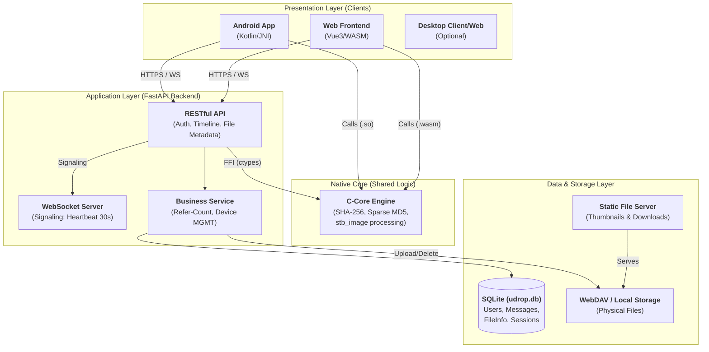

## 时间线功能
采取缓冲刷新，可删除消息，显示发送设备名称，发送时间，文件大小
支持搜索消息，hashtag，搜索本地缓存和后端数据库

## 文件下载
使用fastapi的response（Content-Disposition重命名文件）

## 文件闪传（匹配哈希）
两个阶段
文件先快速哈希（头中尾md5各4kb）
假如md5碰撞后再进行全量blake3（此阶段与上传并行）

## 预览图
暂时支持jpg，png，bmp，上传后（或者客户端跑）再服务端运行c的动态链接库，下发预览图url

后端记录登录设备id，类型（网页/android），支持用户登陆后管理已登陆设备

## websocket连接
websocket连接心跳间隔30s
通过websocket下发控制信息：
更新时间线，退出登录

## 安卓客户端
支持intent分享
调用核心算法.so

## 网页端
使用wasm跑c.so

## 进阶内容，想到了要做再做，优先级从高到低
剪贴板同步
webdav支持？但不知道架构怎么调，webdav占据哪个位置
语义向量搜索?
断点续传
mdns局域网设备发现
类localsend局域网设备文件投放/p2p传送
go重构后端？

